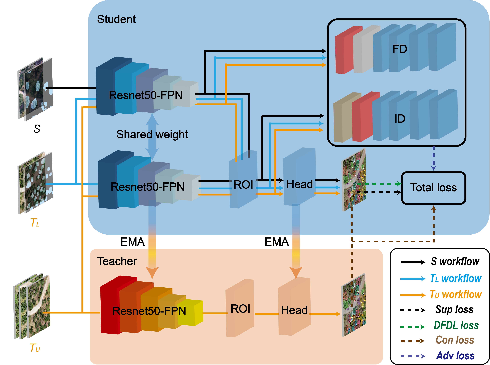

# DFANet: Dual-Level Domain Alignment and Boundary-Aware Optimization for Semi-Supervised Tree Crown Instance Segmentation in UAV Imagery

[](https://opensource.org/licenses/MIT)
[](https://pytorch.org/)

This repository is the official implementation of the paper:
**"Dual-Level Domain Alignment and Boundary-Aware Optimization for Semi-Supervised Tree Crown Instance Segmentation in UAV Imagery"**.

Under review at **IEEE Journal of Selected Topics in Applied Earth Observations and Remote Sensing (J-STARS)**.

## 🌟 Introduction
DFANet is a semi-supervised domain adaptation framework designed for dense instance segmentation in remote sensing. It features:
- **Dual-Level Adversarial Network (DLAN)**: Aligns both global contextual features and local instance-level features.
- **Dual-Focus Dice Loss (DFDL)**: An asymmetric boundary-aware loss to resolve crown adhesion in dense canopies.
- **Mean Teacher Architecture**: Leveraging consistency regularization for label efficiency.



## 🛠️ Installation

### Requirements
- Linux (Ubuntu 22.04 recommended)
- Python 3.8+
- PyTorch 2.1.0
- CUDA 12.1

### Setup
```bash
# Clone the repository
git clone [https://github.com/2522891220/DFANet.git](https://github.com/2522891220/DFANet.git)
cd DFANet

# Create a virtual environment
conda create -n dfanet python=3.9
conda activate dfanet

# Install dependencies
pip install -r requirements.txt
# Or install manually
pip install torch==2.1.0 torchvision==0.16.0 --index-url [https://download.pytorch.org/whl/cu121](https://download.pytorch.org/whl/cu121)
pip install opencv-python matplotlib numpy scipy
